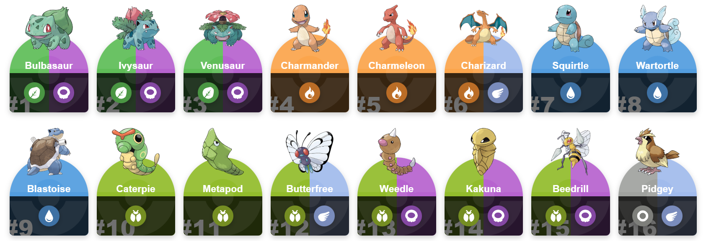
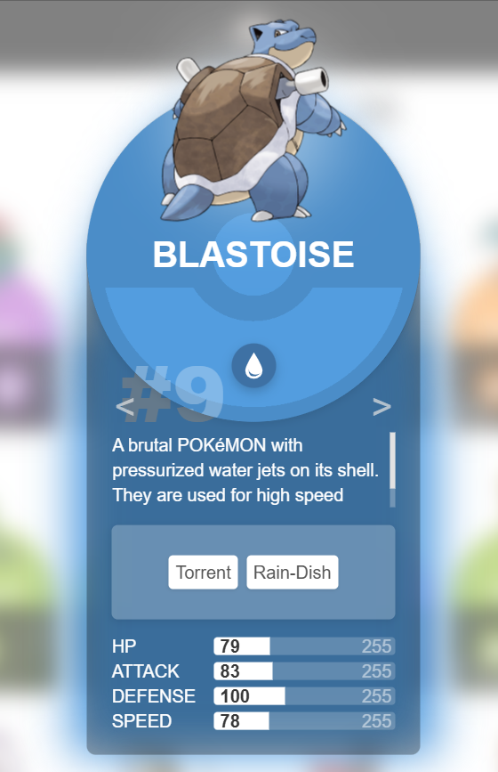

🧿 Pokédex – Gotta Fetch 'Em All!
Welcome to my very first public repository! This is a custom-built Pokédex application developed during a 6-day Weiterbildung at the Developer Akademie. It's a front-end project that pulls data from the PokéAPI to create a responsive, interactive, and stylish Pokédex — with a few personal spins (no pun intended 😉).

🔍 Features
🧭 Browse through Pokémon with generation-based filters (Next / Previous)
🔍 Search Pokémon by name
💡 Click on a Pokémon card to reveal detailed information in a pop-up
🔄 Reset the Pokédex to default view
🌀 Animated card details and pop-up transitions
📱 Fully responsive layout for desktop and mobile

💻 Tech Stack
HTML
CSS
JavaScript (Vanilla)
PokéAPI for live Pokémon data

🎨 Personal Touches
I didn’t just want to recreate a typical Pokédex — I added a bunch of my own stylistic choices, animations, and interactions to give the app a unique feel. Expect some surprises and polish here and there!

📸 Screenshots

### Main View

### Detail Pop-up

📅 Project Timeline
Developed in 6 days during a training course with the Developer Akademie

First full frontend solo project using an external API

🧠 What I Learned
Handling async API calls
DOM manipulation and event handling
Designing a clean UI with CSS Grid & Flexbox
Implementing dynamic filtering and searching
Building accessible and responsive web apps

📫 Feedback & Contributions
As this is my first public project, I’m open to feedback, suggestions, or contributions! Feel free to open an issue or fork the repo.
